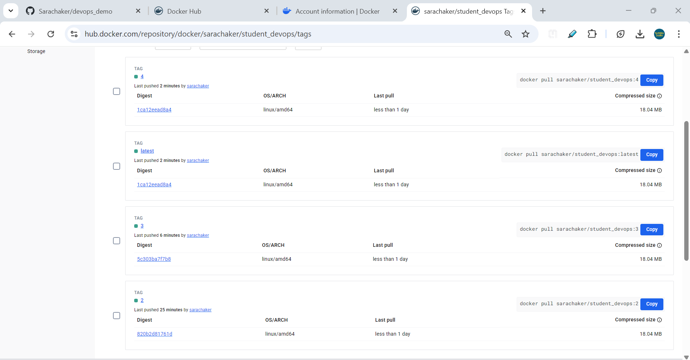

# DevOps Project

This project automatically builds and deploys a Python app using GitHub Actions.

## Files Needed
- `src/app.py` (your Python code)
- `tests/test_app.py` (your tests)
- `Dockerfile` (to build the container)
- `.github/workflows/pipeline.yml` (the automation)

## How It Works
1. When you push code:
   - Tests run automatically
   - If tests pass, a Docker image is built
   - The image is pushed to Docker Hub

## Setup
1. Put these secrets in GitHub:
   - `DOCKER_USER` (your Docker Hub username)
   - `DOCKER_TOKEN` (your Docker Hub token)

2. The system will tag images with:
   - `latest`
   - The build number (like v123)

## Screenshot

